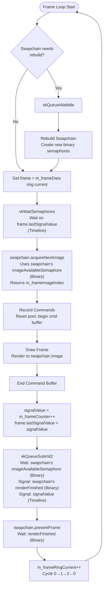
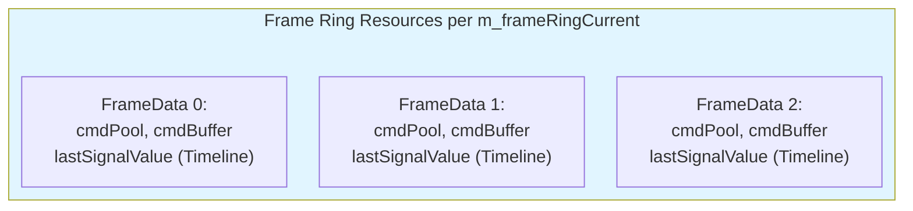
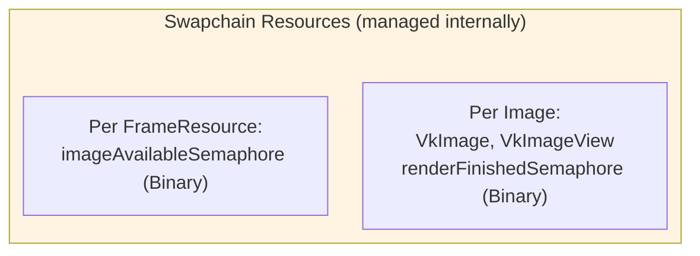
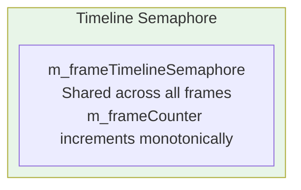

# Modern Vulkan Application Sample


This repository demonstrates contemporary Vulkan API usage patterns in a single, comprehensive file. The example showcases Vulkan 1.4 core functionality, implemented with current best practices. Therefore, Vulkan 1.4 is mandatory.


> **Note**: This is not intended as a tutorial, but rather as a reference implementation demonstrating modern Vulkan development techniques.

## Features Demonstrated

This sample application implements numerous Vulkan concepts and patterns:

### Core Vulkan Setup
* Vulkan Instance creation and management
* Validation layers with configurable settings
* Debug callback implementation
* Physical device selection and logical device creation
* Queue management (graphics queue focus)
* Extension and feature handling with graceful fallbacks

### Modern Rendering Techniques
* Dynamic rendering
* Swapchain management
* Frame synchronization (timeline semaphore)
* Frame resource handling
* Color and depth buffer implementation
* Buffer references
* Specialized constants

### Memory and Resource Management
* Vulkan Memory Allocator (VMA) integration
* Descriptor management (Sets, Layouts, Pools)
* Push descriptors and constants
* SSBO (Shader Storage Buffer Objects) and UBO (Uniform Buffer Objects)
* Image and sampler handling
* Buffer and image barrier management

### Pipeline Implementation
* Graphics pipeline with vertex/fragment shaders
* Compute pipeline and shader integration
* Buffer updates (UBO)

### Third-Party Integration
* Volk for Vulkan function pointer loading
* Dear ImGui for user interface
* GLFW for window management and input handling
* GLM for mathematics operations

### Shader Compilation
* GLSL to SPIR-V compilation
* [Slang](https://github.com/shader-slang/slang) for shader compilation

## Application Overview

When running the application, you'll see:
* A rotating, colored triangle (vertices updated via compute shader)
* A textured triangle
* Screen positioned colored dots
* Triangle intersection demonstration
* Interactive UI elements

## Technical Implementation

### Initialization Flow
1. GLFW initialization provides the window and required Vulkan extensions
1. Vulkan context creation (Instance, Physical/Logical Devices, Queues)
1. Surface creation through GLFW
1. Swapchain initialization
1. VMA allocator setup
1. Resource creation:
   - Command buffers for setup operations
   - Descriptor layouts and sets
   - Pipeline configurations
   - Buffer allocation (SSBO for geometry, UBO for per-frame data)

### Frame Rendering Pipeline
1. Frame synchronization handling
1. Swapchain image acquisition
1. Command buffer recording initiation
1. Compute shader execution
1. Dynamic rendering pass
1. Triangle rendering with descriptor binding and data updates
1. UI rendering
1. Command submission with semaphore synchronization
1. Frame presentation
1. Frame resource cycling

## Prerequisites
- Understanding of C++ programming
- Basic familiarity with graphics programming concepts
- Basic knowledge of Vulkan fundamentals

## Building and Running

```bash
# Clone the repository
git clone https://github.com/nvpro-samples/vk_minimal_latest
cd vk_minimal_latest

# Configure and build
cmake -S . -B build
cmake --build build --config Release

# Running
build\Release\vk_minimal_latest.exe
```

## Dependencies

Besides [Vulkan SDK](https://vulkan.lunarg.com/sdk/home), all the following dependencies will be fetch when configuring CMake.

- GLFW
- GLM
- Dear ImGui
- Volk
- VMA (Vulkan Memory Allocator)

Note: 
- The Vulkan SDK should be installed and the `VULKAN_SDK` environment variable set.
- Using Vulkan SDK 1.3.296 and up, Slang will be the default shader language, but 
  you can change it to GLSL by setting the `USE_SLANG` CMake option to `OFF`.

## License
Apache-2.0

## Miscellanea

### Timeline Semaphore

With N frames in flight, you need to ensure that you're not overwriting resources that might still be in use by the GPU from N frames ago.

This implementation uses a **monotonic counter** (`m_frameCounter`) that increments by 1 with each submit. Each frame resource stores the timeline value it last signaled (`lastSignalValue`), and waits on that value before reuse.

Example with 3 frames in flight:

```text
Timeline semaphore initial value: 0
m_frameCounter starts at: 1

Frame 0 (using frame resource slot 0):
- wait(0)      // Passes immediately (semaphore at 0)
- Submit work
- signal(1)    // m_frameCounter = 1, then increment to 2
- frame[0].lastSignalValue = 1

Frame 1 (using frame resource slot 1):
- wait(0)      // Passes (semaphore now at 1)
- Submit work
- signal(2)    // m_frameCounter = 2, then increment to 3
- frame[1].lastSignalValue = 2

Frame 2 (using frame resource slot 2):
- wait(0)      // Passes (semaphore now at 2)
- Submit work
- signal(3)    // m_frameCounter = 3, then increment to 4
- frame[2].lastSignalValue = 3

Frame 3 (reusing frame resource slot 0):
- wait(1)      // NOW blocks until Frame 0 completes (GPU signals 1)
- Submit work
- signal(4)    // m_frameCounter = 4, then increment to 5
- frame[0].lastSignalValue = 4

Frame 4 (reusing frame resource slot 1):
- wait(2)      // Blocks until Frame 1 completes (GPU signals 2)
- Submit work
- signal(5)
- frame[1].lastSignalValue = 5
```

**Key advantages:**
- Strictly monotonic timeline values (1, 2, 3, 4...) - no duplicate signals possible
- Simple to understand and debug: each frame gets the next number
- Clean architecture: timeline for app-level frame pacing, binary semaphores encapsulated in swapchain


### Frame Synchronization Flow









**Architecture Notes:**

- **Frame ring index** (`m_frameRingCurrent`) cycles through application-managed frame resources (command buffers, timeline tracking)
- **Swapchain image index** (`m_frameImageIndex`) is chosen by the presentation engine via `vkAcquireNextImageKHR()`
- These indices are **independent** - frame resource slot 0 might render to swapchain image 2
- **Binary semaphores** (`imageAvailableSemaphore`, `renderFinishedSemaphore`) are fully encapsulated in the `Swapchain` class
- **Timeline semaphore** is managed at the application level with a simple monotonic counter (`m_frameCounter`)
- This separation provides clear ownership: swapchain handles WSI synchronization, application handles frame pacing


## Sequence Diagram

```mermaid
sequenceDiagram
    participant App as App Frame Ring
    participant Timeline as Timeline Semaphore
    participant Swapchain as Swapchain
    participant GPU as GPU Queue
    
    Note over App,GPU: Frame ring=0 (first use of slot 0)<br/>Timeline=0, lastSignalValue[0]=0
    App->>Timeline: Wait(0) on ring=0
    Timeline-->>App: Passes immediately (current>=0)
    App->>Swapchain: acquireNextImage()
    Swapchain-->>App: frameRes=0, image=?
    App->>GPU: Submit ring=0, signal(1)
    GPU->>Timeline: Signal(1) when done
    App->>Swapchain: presentFrame(frameRes=0)
    Note over App: ring→1, frameRes→1<br/>lastSignalValue[0]=1
    
    Note over App,GPU: Frame ring=1 (first use of slot 1)<br/>lastSignalValue[1]=0
    App->>Timeline: Wait(0) on ring=1
    Timeline-->>App: Passes immediately (current>=1)
    App->>Swapchain: acquireNextImage()
    Swapchain-->>App: frameRes=1, image=?
    App->>GPU: Submit ring=1, signal(2)
    GPU->>Timeline: Signal(2) when done
    App->>Swapchain: presentFrame(frameRes=1)
    Note over App: ring→2, frameRes→2<br/>lastSignalValue[1]=2
    
    Note over App,GPU: Frame ring=2 (first use of slot 2)<br/>lastSignalValue[2]=0
    App->>Timeline: Wait(0) on ring=2
    Timeline-->>App: Passes immediately (current>=2)
    App->>Swapchain: acquireNextImage()
    Swapchain-->>App: frameRes=2, image=?
    App->>GPU: Submit ring=2, signal(3)
    GPU->>Timeline: Signal(3) when done
    App->>Swapchain: presentFrame(frameRes=2)
    Note over App: ring→0, frameRes→0<br/>lastSignalValue[2]=3
    
    Note over App,GPU: Frame ring=0 (reusing slot 0)<br/>lastSignalValue[0]=1
    App->>Timeline: Wait(1) on ring=0
    Note over Timeline: May block until GPU signals 1
    Timeline-->>App: Passes (current>=3)
    App->>Swapchain: acquireNextImage()
    Swapchain-->>App: frameRes=0, image=?
    App->>GPU: Submit ring=0, signal(4)
    GPU->>Timeline: Signal(4) when done
    App->>Swapchain: presentFrame(frameRes=0)
    Note over App: ring→1, frameRes→1<br/>lastSignalValue[0]=4
    
    Note over App,GPU: Pattern continues:<br/>ring cycles 0→1→2→0...<br/>frameRes cycles 0→1→2→0...<br/>timeline increments 1→2→3→4→5...<br/>Each ring waits for its last signal value
  ```
